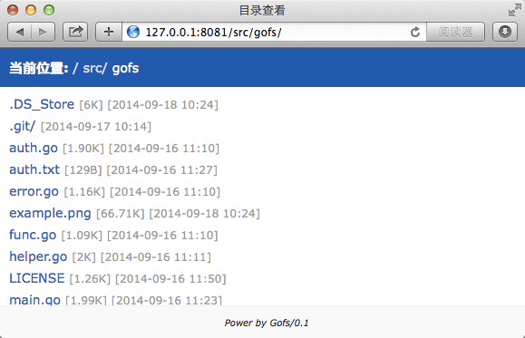

Gofs
====

##### Gofs(Go File Server)目录服务器


## Gofs是什么？

Gofs是一个简单的目录文件共享服务器，整个程序只有一个可执行文件，它可以运行在Linux/Unix/Windows下。

## 为什么要用它？

Gofs是不是重复造轮子呢？相比Nginx/Apache等主流Web服务器，Gofs更为轻巧灵活，共享目录只需要简单在要共享的目录中执行 `gofs -noauth` 即可，免去了复杂的配置，主要适合于浏览静态文件等。

## 有哪些功能？

Gofs的设计初衷上，追求的是简单快速，不求多强大只求实用：
- 轻松的目录文件共享
- 权限限制，支持正则表达，权限精细控制到文件

## 如何使用？

```
> gofs -h 
Usage of gofs: 
 -auth="": auth file 
 -debug=false: debug mode 
 -d="/root": service directory (shorthand) 
 -dir="/root": service directory 
 -h="": service listen host (shorthand) 
 -host="": service listen host 
 -noauth=false: is noauth 
 -p=8081: service listen port (shorthand) 
 -port=8081: service listen port
```

### Auth file格式：

```
用户名 : 密码的MD5 [:权限规则[;权限规则[...]]] 
```

#### 例如：

Join可以查看所有文件`Join:e10adc3949ba59abbe56e057f20f883e`，Aimee只可以看.doc文件 `Aimee:e10adc3949ba59abbe56e057f20f883e:\.doc$`，Zoe只可以看/games文件夹下的文件 `Zoe:e10adc3949ba59abbe56e057f20f883e:^/game`

## License

This project is under the BSD-style License. See the LICENSE file for the full license text.
